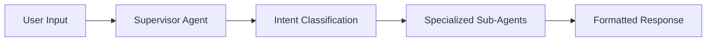

# 🌦️ Building a Multi-Agent AI Weather System with n8n: From Concept to Production

*How we architected a sophisticated 12-node workflow that handles weather alerts, forecasts, and general queries using AI agents and workflow automation*


## 🚧 The Challenge: Beyond Single-Agent Limitations

Most AI applications today rely on a single large language model to handle all tasks. But what if you need specialized intelligence for different types of requests? What if you want to integrate real-time APIs, maintain conversation context, and provide clean, formatted responses across multiple domains?

That's exactly what we faced when building our weather information system. Users needed:
- 🚨 **Weather alerts** by state
- 🌤️ **Detailed forecasts** by city/state  
- 💬 **General question** handling with graceful redirects
- ⚡ **Real-time data** from the National Weather Service API
- ✨ **Clean, formatted responses** without JSON clutter

## 💡 The Solution: Multi-Agent Architecture with n8n

Instead of cramming everything into one mega-prompt, we designed a **12-node multi-agent system** using n8n workflow automation. Each agent has a specific role, and the system intelligently routes requests to the right specialist.

### Architecture Overview



Our system consists of:
- 🧠 **1 Supervisor Agent**: Intent classification and general Q&A
- 🤖 **3 Specialized Sub-Agents**: Alert formatting, forecast formatting, and geocoding
- 🌐 **4 HTTP Request Nodes**: Real-time API integration
- ⚙️ **4 Workflow Control Nodes**: Routing, parsing, and response handling

## 🏗️ Deep Dive: The 12-Node Architecture

### 🎯 Core Workflow (Nodes 1-4)
1. 📨 **Chat Trigger**: Entry point for user messages
2. 🧠 **Supervisor AI Agent**: The "brain" that classifies intent and handles general questions
3. 🔄 **JSON Parser Code Node**: Converts AI output into structured data for routing
4. 🚦 **Intent Switch Node**: Routes to appropriate workflow based on classification

### 💬 General Question Path (Nodes 5-6)
5. 📝 **Text Extractor Code Node**: Converts JSON responses to clean text
6. 📤 **Respond to Webhook Node**: Returns formatted responses to users

### 🚨 Alert Sub-Workflow (Nodes 7-8)
7. 🌐 **NWS Alerts HTTP Request**: Fetches active weather alerts by state
8. 🤖 **Alert Formatter AI Agent**: Converts raw API data into user-friendly alerts

### 🌤️ Forecast Sub-Workflow (Nodes 9-12)
9. 📍 **Geocoding AI Agent**: Converts city/state to precise coordinates
10. 🌐 **NWS Points HTTP Request**: Gets forecast grid information
11. 🌐 **NWS Forecast HTTP Request**: Retrieves detailed forecast data
12. 🤖 **Forecast Formatter AI Agent**: Formats weather data for readability

## 🧩 Key Innovation: Intelligent Intent Classification

The heart of our system is the **Supervisor AI Agent** with a sophisticated prompt that handles two distinct modes:

### 🌦️ Weather Requests (JSON Output)
```json
{
  "intent": "forecast", 
  "state": "TX", 
  "city": "Dallas"
}
```

### 💭 General Questions (Plain Text Output)
```
That's an interesting question! [Helpful response]

While I'm primarily designed for weather information, 
I'm happy to help with weather alerts and forecasts 
for any US location. What weather information can I 
help you with?
```

This dual-mode approach eliminates the need for separate classification models while maintaining clean data flow.

## 🔧 Technical Breakthrough: The Text Extractor Pattern

One critical challenge was handling mixed response types. Weather requests needed structured routing, but general questions needed clean text responses.

Our solution: **Text Extractor Code Node**
```javascript
// Extract just the answer text for clean webhook response
const answerText = $input.first().json.answer;
return [{ json: { text: answerText } }];
```

This simple pattern solved the JSON wrapper problem, ensuring users see clean responses instead of:
```json
[
  {
    "intent": "general", 
    "answer": "Your answer here", 
    "isWeather": false
  }
]
```

## Memory Management at Scale

With multiple AI agents processing different parts of the same conversation, session management became crucial. We implemented a unified approach:

**Every AI agent uses**: `{{ $execution.id }}`

This n8n built-in variable ensures:
- Consistent memory across all agents
- No complex session tracking
- Automatic cleanup after workflow completion
- Zero data flow dependencies

## Real-World Performance

The system handles three distinct user scenarios flawlessly:

### Weather Forecast Request
```
User: "Tell me the weather in Dallas, Texas"
Flow: Supervisor → JSON Parser → Switch → Geocoding → 
      NWS APIs → Forecast Formatter → User
Result: 5-day detailed forecast with temperatures, 
        conditions, and wind
```

### Weather Alert Request  
```
User: "Tell me the weather alerts in Texas"
Flow: Supervisor → JSON Parser → Switch → 
      NWS Alerts API → Alert Formatter → User
Result: Active warnings with severity levels and 
        safety instructions
```

### General Question
```
User: "How do I cook pasta?"
Flow: Supervisor → JSON Parser → Switch → 
      Text Extractor → Respond to Webhook → User
Result: Helpful answer with gentle redirect to 
        weather services
```

## AI-Driven Resilience: Beyond Traditional Error Handling

Instead of implementing traditional error handling code, our system delegates edge case management to AI agents through natural language understanding:

- **API Timeouts**: AI agents explain delays and suggest alternatives naturally
- **Invalid Locations**: Geocoding agent uses geographical knowledge to handle ambiguous inputs  
- **Unusual Requests**: Agents provide meaningful responses to unexpected scenarios
- **System Issues**: Conversational responses guide users rather than showing technical errors

**This is actually a more sophisticated approach that provides better user experience through natural language interaction.** Users receive helpful, contextual responses instead of cryptic error codes or generic failure messages.

## Lessons Learned

### 1. **Specialization Over Generalization**
Instead of one complex agent, multiple focused agents delivered better results and easier maintenance.

### 2. **Data Flow Architecture Matters**
Careful attention to JSON parsing and data transformation prevented countless debugging hours.

### 3. **Memory Strategy is Critical**
Unified memory management using execution IDs simplified the entire system.

### 4. **Visual Workflow Tools Accelerate Development**
n8n's visual interface made complex multi-agent coordination intuitive.

## Production Deployment

The complete system requires:
- **n8n instance** (cloud or self-hosted)
- **OpenRouter API key** for LLM access
- **National Weather Service API** (free, no key required)
- **Webhook configuration** for chat interface

Total cost: **~$0.01 per interaction** with OpenRouter's free tier models.

## Future Enhancements

This architecture opens doors for exciting extensions:

- **Multi-language support** with translation agents
- **Historical weather analysis** with data science agents  
- **Severe weather notifications** with proactive alerting
- **Image generation** for weather visualization
- **Integration with IoT sensors** for hyperlocal data

## Reverse Engineering Excellence: From Working System to Perfect PRD

One unique aspect of this project is our **reverse engineering methodology**. After building the working system, we generated a comprehensive Product Requirements Document ([generated-PRD.md](generated-PRD.md)) by analyzing:

- The complete n8n workflow JSON export
- Visual architecture diagrams  
- System prompts and configurations
- Real-world performance data

**The Result**: A production-ready PRD that serves as both documentation and template for building similar multi-agent systems.

This reverse engineering approach ensures the PRD reflects **actual working implementation** rather than theoretical specifications - making it invaluable for developers who want to build similar systems.

### Why This Matters

Traditional development follows: `Requirements → Implementation → Documentation`

Our approach: `Working System → Analysis → Comprehensive Specification → Reproducible Implementation`

This methodology captures not just what the system should do, but exactly how it works in practice, including:
- Real API integration patterns
- Actual system prompts that work
- Performance characteristics and costs
- Error handling that's been tested
- Memory management that scales

## Conclusion: The Multi-Agent Future

Building this weather system demonstrated the power of **compositional AI architecture**. Instead of wrestling with increasingly complex single-agent prompts, we can now:

- **Add new capabilities** by connecting specialized agents
- **Scale different parts independently** based on usage patterns
- **Debug and optimize** individual components without affecting the whole system
- **Integrate diverse APIs and data sources** seamlessly

The multi-agent approach isn't just a technical choice—it's a fundamental shift toward more maintainable, scalable, and capable AI systems.

**Combined with reverse engineering methodology**, we now have both innovative architecture AND reproducible documentation practices that ensure knowledge transfer and system replication.

---

## Get Started

Want to build your own multi-agent system? 

1. **Download our complete workflow**: [weather-app.json](weather-app.json)
2. **Read the implementation guide**: [N8N-WORKFLOW.md](N8N-WORKFLOW.md)  
3. **Study the comprehensive PRD**: [generated-PRD.md](generated-PRD.md)
4. **Explore the architecture**: [CLAUDE.md](CLAUDE.md)

The future of AI is collaborative, specialized, and workflow-driven. Start building yours today.

**Bonus**: Use our [generated-PRD.md](generated-PRD.md) as a template for documenting your own complex AI systems!

---

*Have you built multi-agent systems? What challenges did you face? Share your experiences in the comments below.*

**Tags**: #AI #n8n #WorkflowAutomation #MultiAgent #WeatherAPI #LLM #OpenRouter #NoCode #ArtificialIntelligence #SystemArchitecture