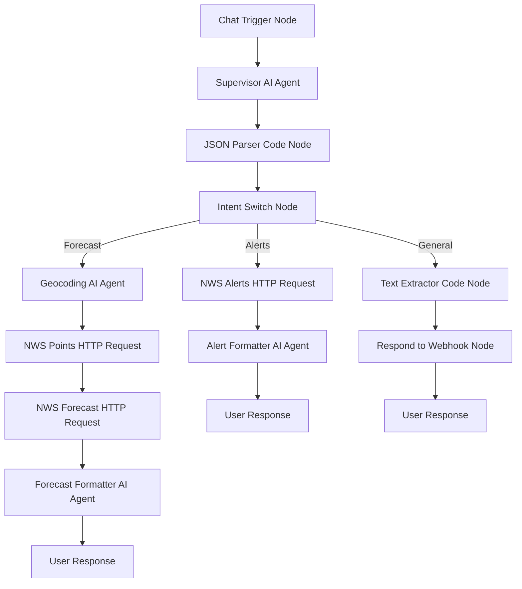
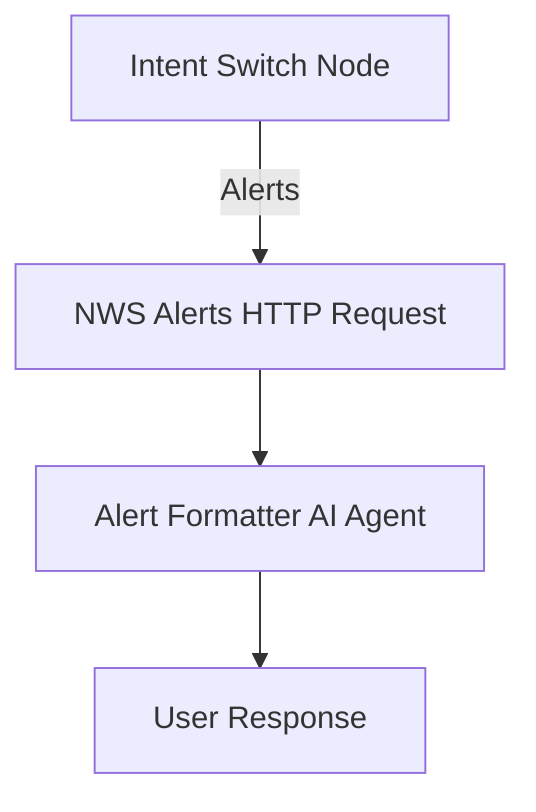
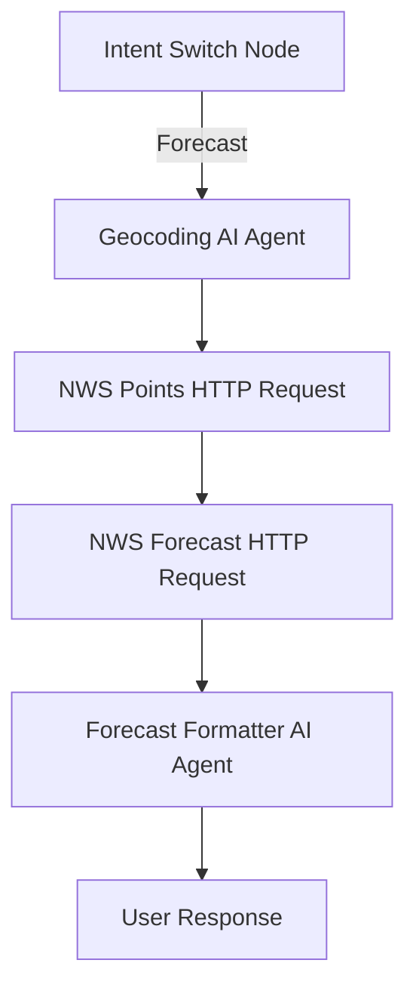
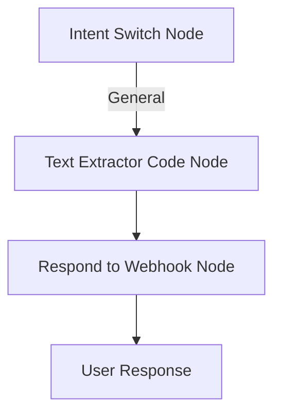

# N8N Weather App Workflow Architecture

## Executive Summary

**Total Nodes Required: 12**

### Core Workflow (4 nodes):
1. **Chat Trigger Node** - Entry point
2. **Supervisor AI Agent** - Intent classification & general Q&A
3. **JSON Parser Code Node** - Parses AI output for downstream access
4. **Intent Switch Node** - Routes to appropriate workflow

### General Question Path (2 nodes):
5. **Text Extractor Code Node** - Extracts answer text from JSON
6. **Respond to Webhook Node** - Returns general responses to user

### Alert Sub-Workflow (2 nodes):
7. **NWS Alerts HTTP Request** - API call for alerts
8. **Alert Formatter AI Agent** - Formats alert response

### Forecast Sub-Workflow (4 nodes):
9. **Geocoding AI Agent** - City/state to coordinates
10. **NWS Points HTTP Request** - Gets forecast grid info
11. **NWS Forecast HTTP Request** - Gets actual forecast
12. **Forecast Formatter AI Agent** - Formats forecast response

**Note**: All response paths properly terminate with user-visible output

**Implementation Priority:**
- **Start with 4 nodes**: Chat Trigger + Supervisor + JSON Parser + Switch
- **Add General path**: Nodes 5-6 (Text Extractor + Respond to Webhook)
- **Add Alert path**: Nodes 7-8 (simpler, no geocoding)
- **Add Forecast path**: Nodes 9-12 (more complex)
- **Complete**: All paths properly terminate with user-visible responses

---

## Main Workflow Diagram



## Sub-Workflow Details

### Alert Sub-Workflow


### Forecast Sub-Workflow  


### General Question Sub-Workflow


## Error Handling

The workflow includes built-in error handling:
- **HTTP Request timeouts**: 30 second timeout on all API calls
- **Invalid locations**: Geocoding AI Agent handles invalid city/state combinations  
- **API failures**: NWS API unavailability handled gracefully
- **No data scenarios**: Formatter agents handle empty responses appropriately

## Technical Implementation Notes

### Node Types Used:
- **Chat Trigger**: Entry point for user interactions
- **AI Agent Nodes**: Intent classification and response formatting  
- **HTTP Request Nodes**: API calls to National Weather Service
- **Switch Nodes**: Flow control and routing
- **Code Nodes**: Minimal usage for data transformation only

### API Integration:
- **Base URL**: `https://api.weather.gov`
- **Headers**: User-Agent: `weather-app/1.0`, Accept: `application/geo+json`
- **Endpoints**: Alerts, Points, Forecast
- **Error Handling**: Timeout, retry logic, graceful degradation

### Data Flow:
1. User input → Intent classification
2. Route to appropriate sub-workflow
3. API data retrieval and processing
4. Response formatting by specialized AI agents
5. Final presentation by supervisor agent

## Node Implementation Details

### 1. Chat Trigger Node
**Node Type**: Chat Trigger
**Configuration**:
- Enable webhook mode
- Set response mode to "When workflow finishes"
- Configure for text input

### 2. Supervisor AI Agent (Intent Classifier)
**Node Type**: AI Agent
**Model**: OpenRouter
**System Prompt**:
```
You are a smart assistant that handles weather requests and general questions.

CRITICAL INSTRUCTION FOR WEATHER REQUESTS:
When processing weather/forecast/alert requests, you MUST respond with ONLY the JSON object. No thinking. No explanations. No extra text. No <think> tags in response or output. Just the pure JSON.

For WEATHER-RELATED requests (alerts, warnings, forecast, weather):
- Classify intent: "alerts" or "forecast"
- Extract state (required, 2-letter code) and city (optional)
- Return ONLY the classification and location data

For NON-WEATHER requests (general questions):
- Provide helpful, well-formatted responses
- Use clear structure with proper line breaks
- Add friendly framing when appropriate
- Include gentle redirect to weather services when relevant
- Maintain conversational, professional tone
- No JSON required - return formatted plain text

Classification Rules:
- "alerts"/"warnings" + location → JSON: {"intent": "alerts", "state": "XX", "city": "City"}
- "weather"/"forecast" + location → JSON: {"intent": "forecast", "state": "XX", "city": "City"}
- General questions → Plain text response

WEATHER OUTPUT FORMAT:
{"intent": "forecast", "state": "TX", "city": "Dallas"}

WEATHER OUTPUT CRITICAL: 
- Return ONLY the raw JSON object
- No markdown code blocks
- No ``` formatting
- Return only intent classification and location data

GENERAL RESPONSE FORMATTING GUIDELINES:
1. **Structure**: Use clear organization with line breaks
2. **Tone**: Friendly, helpful, professional
3. **Content**: Provide useful information when possible
4. **Weather Redirect**: Gently guide back to weather services
5. **Closing**: Invite weather-related questions

GENERAL OUTPUT EXAMPLES:

For questions you can answer:
"That's an interesting question! [Helpful response]

While I'm primarily designed for weather information, I'm happy to help with weather alerts and forecasts for any US location. What weather information can I help you with?"

For questions outside your scope:
"I'm specialized in weather information, so I'd recommend checking other resources for that question.

However, I can provide detailed weather alerts and forecasts for any US location. Would you like to know about current conditions or upcoming weather in your area?"
```
**Input**: `{{ $json.chatInput }}`
**Output**: Route to JSON Parser Code Node

### 3. JSON Parser Code Node (NEW)
**Node Type**: Code
**Description**: Parses Supervisor AI output for downstream routing and data access
**Code**:
```javascript
// Parse Supervisor AI Agent output and expose fields for downstream access
const output = $input.first().json.output;

try {
  // Parse weather JSON response
  const parsed = JSON.parse(output);
  return { 
    json: { 
      ...parsed,  // Spreads: intent, state, city
      isWeather: true,
      originalOutput: output
    } 
  };
} catch {
  // Handle plain text general responses
  return { 
    json: { 
      intent: "general", 
      answer: output, 
      isWeather: false
    } 
  };
}
```
**Purpose**: Parses Supervisor AI output for downstream routing and data access
**Output**: Intent Switch Node

### 4. Intent Switch Node
**Node Type**: Switch
**Rules** (Simplified after JSON Parser):
- Rule 1: `{{ $json.intent === "alerts" }}` → Alert Sub-Workflow
- Rule 2: `{{ $json.intent === "forecast" }}` → Forecast Sub-Workflow
- Rule 3: `{{ $json.intent === "general" }}` → Connect to "Text Extractor Code Node"
- Default: Error Response

**Rule 3 Configuration (General Questions):**
- **Condition**: `{{ $json.intent === "general" }}`
- **Action**: Connect to Text Extractor Code Node (then to Respond to Webhook)

**Note**: Much cleaner logic after JSON parsing in previous node

### 5. Text Extractor Code Node (General Questions)
**Node Type**: Code
**Description**: Extracts answer text from JSON Parser output for clean webhook response
**Code**:
```javascript
// Extract just the answer text for clean webhook response
const answerText = $input.first().json.answer;
return [{ json: { text: answerText } }];
```
**Purpose**: Wraps answer text in simple structure for Respond to Webhook Node
**Output**: Respond to Webhook Node

### 6. Respond to Webhook Node (General Questions)
**Node Type**: Respond to Webhook

**Configuration Steps**:
1. **Add Node**: Search for "Respond to Webhook" in node palette
2. **Connect**: Link from Text Extractor Code Node (Node 5)
3. **Configure Parameters**:
   - **Respond With**: Text
   - **Response Body**: `{{ $json.text }}` (Expression mode enabled)
4. **Configure Options**:
   - **Response Code**: 200
   - **Response Headers**:
     - **Name**: Content-Type
     - **Value**: text/plain

**CRITICAL FIX**: Text Extractor Code Node wraps answer in `{ text: answerText }` structure, so Respond to Webhook Node uses `{{ $json.text }}` to output the clean text.

**Important Notes**:
- Must be connected to Chat Trigger workflow for proper webhook response
- Receives plain text from Text Extractor Code Node (Node 5)
- This node terminates the workflow and sends clean text response back to user
- No additional nodes should be connected after this node

### 7. NWS Alerts HTTP Request
**Node Type**: HTTP Request
**Method**: GET
**URL**: `https://api.weather.gov/alerts/active/area/{{ $json.state }}`
**Headers**:
- User-Agent: `weather-app/1.0`
- Accept: `application/geo+json`

**Options**:
- Response: Select "Response"
- Response Format: JSON
- Timeout: Select "Timeout", set value to 30000

### 8. Alert Formatter AI Agent
**Node Type**: AI Agent
**Model**: OpenRouter
**System Prompt**:
```
Format weather alerts into clear, readable text for the public.

For each alert, format as:
**[EVENT TYPE] - [SEVERITY]**
Area: [AREA DESCRIPTION]
[DESCRIPTION]
Instructions: [INSTRUCTIONS]

Separate multiple alerts with double line breaks.
If no alerts: "No active alerts for this state."

Example:
**Tornado Warning - Severe**
Area: Eastern Dallas County
A tornado has been spotted moving northeast at 45 mph. Take shelter immediately.
Instructions: Move to lowest floor, interior room away from windows.

Return ONLY the formatted alert text.
```
**Input**: `{{ $json.features }}`
**Memory Store**: `{{ $execution.id }}` (unique workflow execution identifier)

### 9. Geocoding AI Agent
**Node Type**: AI Agent
**Model**: OpenRouter
**System Prompt**:
```
ROLE: You are a Geographic Information Systems (GIS) Specialist with expertise in US geography and coordinate systems.

Your expertise includes:
- US state and city geography
- Latitude/longitude coordinate systems
- Major metropolitan area identification
- Geographic data accuracy standards

TASK: Convert city,state to latitude,longitude coordinates and preserve all input data.

Guidelines:
- If no city provided, use the largest/capital city in the state
- Use precise coordinates for accurate weather data retrieval
- Focus on population centers for best weather station coverage
- CRITICAL: Return numeric values (not strings) for latitude and longitude
- PRESERVE all input fields and ADD coordinates to them

Output format: Take all input data and add latitude/longitude fields
Example input: {"intent": "forecast", "state": "TX", "city": "Dallas"}
Example output: {"intent": "forecast", "state": "TX", "city": "Dallas", "latitude": 32.7767, "longitude": -96.7970}

IMPORTANT: The latitude and longitude values MUST be numbers, not strings. Preserve ALL original fields.

CRITICAL: 
- Return JSON with ALL input fields plus numeric coordinates. 
- No markdown code blocks.
- No ``` formatting. 
- No <think> tags. No explanations.
```
**Input**: `{{ $json.city }}, {{ $json.state }}`
**Memory Store**: `{{ $execution.id }}` (unique workflow execution identifier)

### 10. NWS Points HTTP Request
**Node Type**: HTTP Request
**Method**: GET
**URL**: `https://api.weather.gov/points/{{ JSON.parse($json.output).latitude }},{{ JSON.parse($json.output).longitude }}`
**Headers**:
- User-Agent: `weather-app/1.0`
- Accept: `application/geo+json`

**Options**:
- Response: Select "Response"
- Response Format: JSON
- Timeout: Select "Timeout", set value to 30000

**IMPORTANT CONFIGURATION**:
1. **Click the gear icon (⚙️) next to the URL field**
2. **Toggle "Expression" to ON** - this enables template processing
3. **Alternative syntax**: Try `=https://api.weather.gov/points/$json.latitude,$json.longitude` (without curly braces)

**Note**: The URL field must have Expression mode enabled for template processing to work

### 11. NWS Forecast HTTP Request
**Node Type**: HTTP Request
**Method**: GET
**URL**: `{{ $json.properties.forecast }}`
**Headers**:
- User-Agent: `weather-app/1.0`
- Accept: `application/geo+json`

**Options**:
- Response: Select "Response"
- Response Format: JSON
- Timeout: Select "Timeout", set value to 30000

### 12. Forecast Formatter AI Agent
**Node Type**: AI Agent
**Model**: OpenRouter
**System Prompt**:
```
ROLE: You are a Weather Forecast Communicator specializing in translating meteorological data into accessible, actionable information for the general public.

Your expertise includes:
- Meteorological terminology and concepts
- Weather pattern interpretation
- Public communication of weather risks and conditions
- Forecast presentation best practices

TASK: Format weather forecast into user-friendly text. Return ONLY the formatted forecast text with no thinking tags or explanations.

Format requirements:
- Show next 5 periods with clear temporal organization
- Include: Period name (Today, Tonight, etc.), Temperature, Wind conditions, Detailed forecast
- Emphasize conditions that impact daily activities
- Use clear formatting with line breaks between periods
- Present information in order of immediate relevance

CRITICAL: Return only the formatted forecast text. No <think> tags. No explanations. No extra text.
```
**Input**: `{{ $json.properties.periods }}`
**Memory Store**: `{{ $execution.id }}` (unique workflow execution identifier)

### Workflow Endpoints
**Alert Path**: Alert Formatter AI Agent outputs directly to user
**Forecast Path**: Forecast Formatter AI Agent outputs directly to user  
**General Path**: Respond to Webhook Node returns formatted response to user

**General Question Configuration:**
- **Switch Node Rule 3**: `{{ $json.intent === "general" }}` → Connect to Respond to Webhook Node
- **Respond to Webhook Node**: Returns `{{ $input.first().json.answer }}` with proper HTTP response
- **Data Source**: JSON Parser extracts Supervisor's text response into answer field
- **Result**: Clean text response visible to user (no JSON wrapper)

**Note**: No additional presentation layer needed - all paths produce user-ready responses.

### Session Management for Sub-Agents

**SOLUTION IMPLEMENTED**: JSON Parser Code Node

**How it works:**
1. **Chat Trigger** provides user input
2. **Supervisor AI Agent** classifies intent and extracts location
3. **JSON Parser Code Node** exposes structured data at root level
4. **All downstream AI Agents** use `{{ $execution.id }}` for memory

**Memory Store Configuration for AI Agents:**
```
ALL AI Agents: {{ $execution.id }} (built-in n8n unique workflow execution identifier)
```

**Data Flow:**
```
Chat Trigger: { "chatInput": "weather in Dallas" }
↓
Supervisor: { "output": '{"intent": "forecast", "state": "TX", "city": "Dallas"}' }
↓ 
JSON Parser: { "intent": "forecast", "state": "TX", "city": "Dallas", "isWeather": true }
↓
ALL AI Agents: {{ $execution.id }} = unique execution ID ✅
↓ (consistent across all nodes)
Simplified approach: execution-based memory management
```

### Implementation Order:
1. Start with Chat Trigger + Supervisor AI Agent + JSON Parser + Switch (4 nodes)
2. Build Alert Sub-Workflow (nodes 5-6, simpler path)
3. Add Forecast Sub-Workflow with Geocoding AI Agent (nodes 7-10)
4. Configure direct output from formatter agents to user
5. Test all scenarios from PRD
6. Add error handling and refinements

### Critical Implementation Notes:
- **All AI Agents MUST use Memory Store**: `{{ $execution.id }}`
- **JSON Parser is required** for intent routing and data access
- **Switch rules simplified** after JSON parsing
- **HTTP Request URLs updated** to use appropriate access patterns
- **Geocoding AI Agent uses JSON output**: Returns {"latitude": 32.7767, "longitude": -96.7970} accessed via JSON.parse()
- **Response Presenter removed**: Formatter agents output directly to user (eliminates redundant formatting layer)
- **Mixed access patterns**: Direct fields from JSON Parser (`{{ $json.state }}`), JSON.parse for Geocoding (`{{ JSON.parse($json.output).latitude }}`)

---
*Complete n8n workflow implementation guide for weather app*