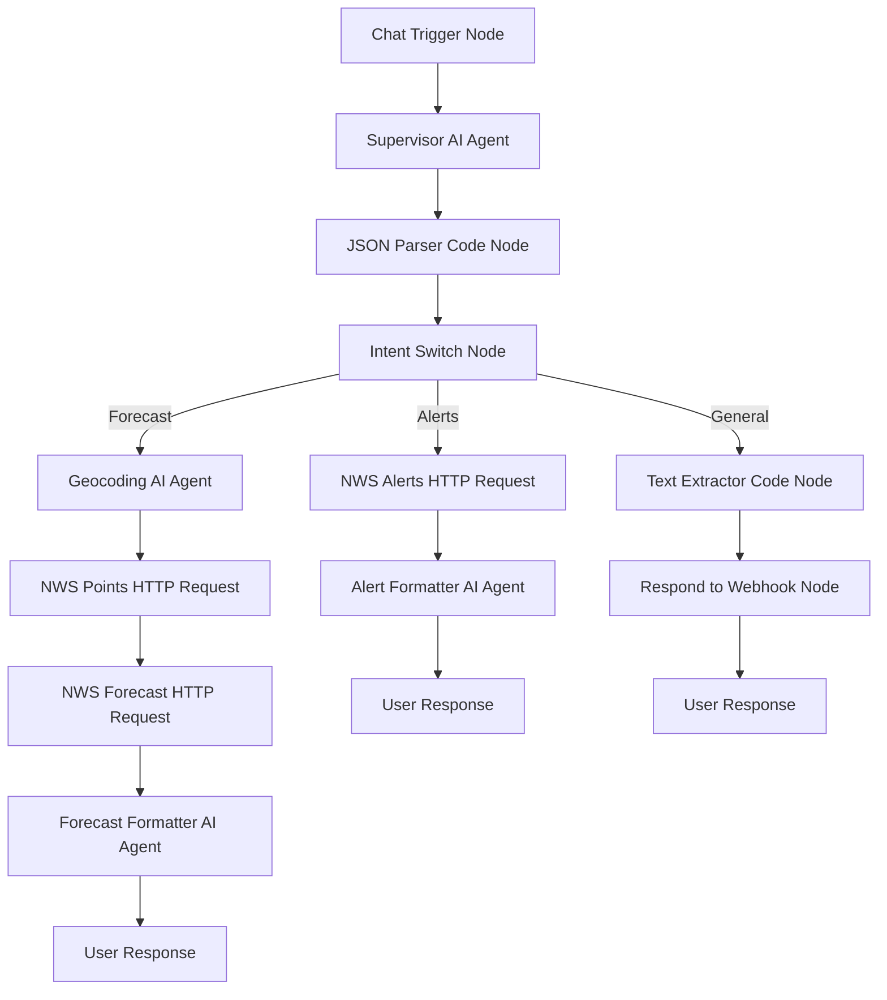
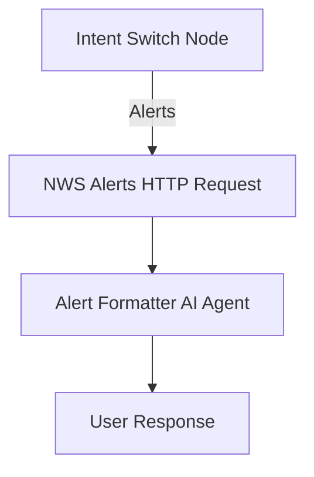
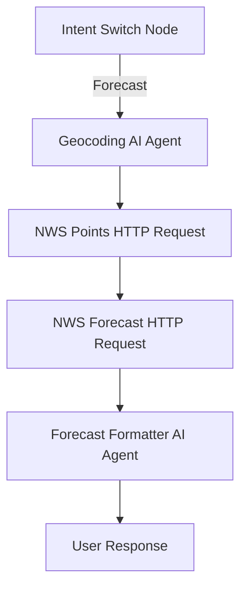
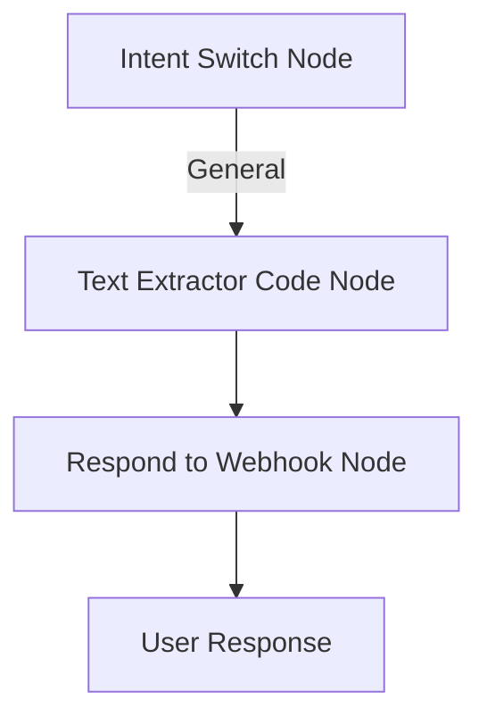

# Product Requirements Document (PRD) - Multi-Agent Weather Information System

**Generated from**: Reverse engineering existing n8n workflow `weather-app.json` and visual diagram `weather-app-n8n.jpg`

## Architecture Overview

### System Architecture Diagram



### Sub-Workflow Details

#### Alert Sub-Workflow


#### Forecast Sub-Workflow  


#### General Question Sub-Workflow


### Architecture Components

**Core Workflow (4 nodes):**
1. Chat Trigger - Entry point for user messages
2. Supervisor Agent - Intent classification and general Q&A  
3. JSON Parser - Transform output for routing
4. Intent Switch - Route based on intent

**General Question Path (2 nodes):**
5. Text Extractor - Extract clean text from JSON
6. Respond to Webhook - Return formatted text to user

**Alert Sub-Workflow (2 nodes):**
7. NWS Alerts Request - Get active alerts by state
8. Alert Formatter Agent - Format alert response

**Forecast Sub-Workflow (4 nodes):**  
9. Geocoding Agent - Convert city/state to coordinates
10. NWS Points Request - Get forecast grid info
11. NWS Forecast Request - Get detailed forecast data
12. Forecast Formatter Agent - Format weather data

**Supporting Infrastructure:**
Each AI agent connects to dedicated OpenRouter Chat Model and Simple Memory nodes for LLM processing and conversation context.

## Product Overview

### Vision Statement
Create an intelligent, multi-agent weather information system that seamlessly handles three distinct user scenarios: weather forecasts, weather alerts, and general questions through a unified chat interface with specialized AI agents.

### Product Goals
1. **Specialized Intelligence**: Deploy focused AI agents for specific tasks rather than a monolithic system
2. **Real-time Data Integration**: Leverage National Weather Service API for authoritative weather information
3. **User Experience Excellence**: Provide clean, formatted responses without technical clutter
4. **Graceful Degradation**: Handle general questions with helpful responses and gentle redirects
5. **Cost Optimization**: Utilize efficient models and execution patterns for sustainable operation

## Target Users

### Primary Users
- **General Public**: Individuals seeking weather information for daily planning
- **Weather-Conscious Users**: People needing reliable alerts and detailed forecasts
- **Casual Users**: Individuals who may ask general questions alongside weather queries

### User Personas
1. **The Daily Planner**: Needs quick, accurate weather forecasts for cities
2. **The Safety-Conscious**: Requires timely weather alerts and warnings by state
3. **The Curious User**: Asks both weather and non-weather questions interchangeably

## Core Functional Requirements

### FR-1: Multi-Agent Architecture
**Requirement**: Implement a 12-node workflow with specialized AI agents and supporting infrastructure
- **Supervisor Agent**: Intent classification and general Q&A (+ Chat Model + Memory)
- **Alert Formatter Agent**: Weather alert processing and formatting (+ Chat Model1 + Memory1)
- **Forecast Formatter Agent**: Weather forecast processing and formatting (+ Chat Model3 + Memory3)  
- **Geocoding Agent**: Location to coordinate conversion (+ Chat Model2 + Memory2)

**Architecture Pattern**: Multi-agent system with dedicated LLM and memory per agent

### FR-2: Intent Classification System
**Requirement**: Intelligent request routing based on user input analysis
- **Weather Alerts**: Route to alert processing workflow
- **Weather Forecasts**: Route to forecast processing workflow
- **General Questions**: Route to direct response system

**Classification Rules**:
```
"alerts"|"warnings" + location → alerts workflow
"weather"|"forecast" + location → forecast workflow
general questions → direct response
```

### FR-3: Weather Alert Processing
**Requirement**: State-based weather alert retrieval and formatting
- **Input**: US state (2-letter code)
- **Data Source**: National Weather Service `/alerts/active/area/{state_code}`
- **Output**: Formatted alerts with event type, area, severity, description, instructions
- **Edge Case Management**: AI agents handle unusual inputs and API issues through natural language understanding

### FR-4: Weather Forecast Processing
**Requirement**: City/state-based detailed weather forecasts
- **Input**: City and state (state-only defaults to largest city)
- **Processing Chain**: Location → Coordinates → NWS Points → Forecast
- **Data Sources**: 
  - Geocoding: AI agent geographical knowledge
  - NWS Points API: `/points/{latitude},{longitude}`
  - NWS Forecast API: `/gridpoints/{office}/{grid_x},{grid_y}/forecast`
- **Output**: 5-period detailed weather forecast with temperatures, conditions, wind

### FR-5: General Question Handling
**Requirement**: Intelligent non-weather query processing
- **Response Strategy**: Helpful answers with gentle weather service redirects
- **Output Format**: Clean, formatted text without JSON wrapper
- **Tone**: Conversational, professional, friendly
- **Redirect Pattern**: Guide users back to weather capabilities

### FR-6: Session Management
**Requirement**: Distributed memory management across all AI agents
- **Memory Strategy**: Each AI agent has dedicated memory node using n8n execution ID (`{{ $execution.id }}`)
- **Memory Nodes**: Simple Memory, Simple Memory1, Simple Memory2, Simple Memory3
- **Consistency**: All memory nodes use same session identifier for coordination
- **Isolation**: Each agent maintains independent conversation context
- **Lifecycle**: Automatic cleanup after workflow completion
- **Persistence**: Maintain context throughout single workflow execution

## Technical Specifications

### TS-1: n8n Workflow Architecture
**Platform**: n8n workflow automation (version 1.x+)
**Node Count**: 12 nodes total + supporting AI infrastructure (memory and LLM connectors)

#### Core Workflow (4 nodes)
1. **Chat Trigger Node** (`@n8n/n8n-nodes-langchain.chatTrigger`)
   - Display name: "When chat message received"
   - Entry point for user messages
   - Webhook-based message reception
   
2. **Supervisor AI Agent** (`@n8n/n8n-nodes-langchain.agent`)
   - Display name: "Supervisor Agent"
   - Connected to: OpenRouter Chat Model + Simple Memory (supporting infrastructure)
   - Dual-mode output: JSON for weather, text for general

3. **JSON Parser Code Node** (`n8n-nodes-base.code`)
   - Display name: "JSON Parser"
   - Transforms supervisor output for routing
   - Handles mixed response types (JSON/text)
   
4. **Intent Switch Node** (`n8n-nodes-base.switch`)
   - Display name: "Intent Switch"
   - Mode: Rules
   - Three output paths: alerts, forecast, general

#### General Question Path (2 nodes)
5. **Text Extractor Code Node** (`n8n-nodes-base.code`)
   - Display name: "Text Extractor"  
   - Extracts clean text from JSON structure
   - Formats for webhook response

6. **Respond to Webhook Node** (`n8n-nodes-base.respondToWebhook`)
   - Display name: "Respond to Webhook"
   - Returns formatted text to user
   - Content-Type: text/plain
   - Connection: From Text Extractor

#### Alert Sub-Workflow (2 nodes)
7. **NWS Alerts HTTP Request** (`n8n-nodes-base.httpRequest`)
   - Display name: "NWS Alerts Request"
   - URL: `https://api.weather.gov/alerts/active/area/{{ $json.state }}`
   - Headers: User-Agent, Accept headers
   - Timeout: 30 seconds

8. **Alert Formatter AI Agent** (`@n8n/n8n-nodes-langchain.agent`)
   - Display name: "Alert Formatter Agent"
   - Connected to: OpenRouter Chat Model1 + Simple Memory1 (supporting infrastructure)
   - Output: Formatted alert text

#### Forecast Sub-Workflow (4 nodes)
9. **Geocoding AI Agent** (`@n8n/n8n-nodes-langchain.agent`)
   - Display name: "Geocoding Agent"
   - Connected to: OpenRouter Chat Model2 + Simple Memory2 (supporting infrastructure)
   - Function: City/state to lat/lng conversion
   - Output: JSON with coordinates preserved

10. **NWS Points HTTP Request** (`n8n-nodes-base.httpRequest`)
    - Display name: "NWS Points Request"
    - URL: `https://api.weather.gov/points/{{ JSON.parse($json.output).latitude }},{{ JSON.parse($json.output).longitude }}`
    - Function: Retrieve forecast grid information

11. **NWS Forecast HTTP Request** (`n8n-nodes-base.httpRequest`)
    - Display name: "NWS Forecast Request"
    - URL: Dynamic from points response
    - Function: Retrieve detailed forecast data

12. **Forecast Formatter AI Agent** (`@n8n/n8n-nodes-langchain.agent`)
    - Display name: "Forecast Formatter Agent"
    - Connected to: OpenRouter Chat Model3 + Simple Memory3 (supporting infrastructure)
    - Output: Formatted forecast text

#### Supporting AI Infrastructure (8 connector nodes)
- **OpenRouter Chat Model** → Supervisor Agent
- **Simple Memory** → Supervisor Agent  
- **OpenRouter Chat Model1** → Alert Formatter Agent
- **Simple Memory1** → Alert Formatter Agent
- **OpenRouter Chat Model2** → Geocoding Agent
- **Simple Memory2** → Geocoding Agent
- **OpenRouter Chat Model3** → Forecast Formatter Agent
- **Simple Memory3** → Forecast Formatter Agent

### TS-2: AI Agent Specifications

#### Supervisor Agent Prompt
```
You are a smart assistant that handles weather requests and general questions.

CRITICAL INSTRUCTION FOR WEATHER REQUESTS:
When processing weather/forecast/alert requests, you MUST respond with ONLY the JSON object. No thinking. No explanations. No extra text. No <think> tags in response or output. Just the pure JSON.

For WEATHER-RELATED requests (alerts, warnings, forecast, weather):
- Classify intent: "alerts" or "forecast"
- Extract state (required, 2-letter code) and city (optional)
- Return ONLY the classification and location data

For NON-WEATHER requests (general questions):
- Provide helpful, well-formatted responses
- Use clear structure with proper line breaks
- Add friendly framing when appropriate
- Include gentle redirect to weather services when relevant
- Maintain conversational, professional tone
- No JSON required - return formatted plain text

Classification Rules:
- "alerts"/"warnings" + location → JSON: {"intent": "alerts", "state": "XX", "city": "City"}
- "weather"/"forecast" + location → JSON: {"intent": "forecast", "state": "XX", "city": "City"}
- General questions → Plain text response

WEATHER OUTPUT FORMAT:
{"intent": "forecast", "state": "TX", "city": "Dallas"}

WEATHER OUTPUT CRITICAL: 
- Return ONLY the raw JSON object
- No markdown code blocks
- No ``` formatting
- Return only intent classification and location data

GENERAL RESPONSE FORMATTING GUIDELINES:
1. **Structure**: Use clear organization with line breaks
2. **Tone**: Friendly, helpful, professional
3. **Content**: Provide useful information when possible
4. **Weather Redirect**: Gently guide back to weather services
5. **Closing**: Invite weather-related questions

GENERAL OUTPUT EXAMPLES:

For questions you can answer:
"That's an interesting question! [Helpful response]

While I'm primarily designed for weather information, I'm happy to help with weather alerts and forecasts for any US location. What weather information can I help you with?"

For questions outside your scope:
"I'm specialized in weather information, so I'd recommend checking other resources for that question.

However, I can provide detailed weather alerts and forecasts for any US location. Would you like to know about current conditions or upcoming weather in your area?"
```

#### Alert Formatter Agent Prompt
```
Format weather alerts into clear, readable text for the public.

For each alert, format as:
**[EVENT TYPE] - [SEVERITY]**
Area: [AREA DESCRIPTION]
[DESCRIPTION]
Instructions: [INSTRUCTIONS]

Separate multiple alerts with double line breaks.
If no alerts: "No active alerts for this state."

Example:
**Tornado Warning - Severe**
Area: Eastern Dallas County
A tornado has been spotted moving northeast at 45 mph. Take shelter immediately.
Instructions: Move to lowest floor, interior room away from windows.

Return ONLY the formatted alert text.
```

#### Geocoding Agent Prompt
```
ROLE: You are a Geographic Information Systems (GIS) Specialist with expertise in US geography and coordinate systems.

Your expertise includes:
- US state and city geography
- Latitude/longitude coordinate systems
- Major metropolitan area identification
- Geographic data accuracy standards

TASK: Convert city,state to latitude,longitude coordinates and preserve all input data.

Guidelines:
- If no city provided, use the largest/capital city in the state
- Use precise coordinates for accurate weather data retrieval
- Focus on population centers for best weather station coverage
- CRITICAL: Return numeric values (not strings) for latitude and longitude
- PRESERVE all input fields and ADD coordinates to them

Output format: Take all input data and add latitude/longitude fields
Example input: {"intent": "forecast", "state": "TX", "city": "Dallas"}
Example output: {"intent": "forecast", "state": "TX", "city": "Dallas", "latitude": 32.7767, "longitude": -96.7970}

IMPORTANT: The latitude and longitude values MUST be numbers, not strings. Preserve ALL original fields.

CRITICAL: 
- Return JSON with ALL input fields plus numeric coordinates. 
- No markdown code blocks.
- No ``` formatting. 
- No <think> tags. No explanations.
```

#### Forecast Formatter Agent Prompt
```
ROLE: You are a Weather Forecast Communicator specializing in translating meteorological data into accessible, actionable information for the general public.

Your expertise includes:
- Meteorological terminology and concepts
- Weather pattern interpretation
- Public communication of weather risks and conditions
- Forecast presentation best practices

TASK: Format weather forecast into user-friendly text. Return ONLY the formatted forecast text with no thinking tags or explanations.

Format requirements:
- Show next 5 periods with clear temporal organization
- Include: Period name (Today, Tonight, etc.), Temperature, Wind conditions, Detailed forecast
- Emphasize conditions that impact daily activities
- Use clear formatting with line breaks between periods
- Present information in order of immediate relevance

CRITICAL: Return only the formatted forecast text. No <think> tags. No explanations. No extra text.
```

### TS-3: Data Processing Specifications

#### JSON Parser Code Node
```javascript
// Parse Supervisor AI Agent output and expose fields for downstream access
const output = $input.first().json.output;

try {
  // Parse weather JSON response
  const parsed = JSON.parse(output);
  return { 
    json: { 
      ...parsed,  // Spreads: intent, state, city
      isWeather: true,
      originalOutput: output
    } 
  };
} catch {
  // Handle plain text general responses
  return { 
    json: { 
      intent: "general", 
      answer: output, 
      isWeather: false
    } 
  };
}
```

#### Text Extractor Code Node
```javascript
// Extract just the answer text for clean webhook response
const answerText = $input.first().json.answer;
return [{ json: { text: answerText } }];
```

### TS-4: API Integration Specifications

#### National Weather Service API
- **Base URL**: `https://api.weather.gov`
- **Authentication**: None required (public API)
- **User-Agent**: `weather-app/1.0` (required by NWS)
- **Accept Header**: `application/geo+json`
- **Timeout**: 30 seconds per request
- **Rate Limiting**: Built-in graceful handling

#### OpenRouter API Integration
- **Provider**: OpenRouter (https://openrouter.ai)
- **Model**: `deepseek/deepseek-chat-v3-0324:free`
- **Authentication**: API key via n8n credentials
- **Cost**: ~$0.01 per interaction (free tier)
- **Credential Management**: Parameterized for easy setup

## Non-Functional Requirements

### NFR-1: Performance
- **Response Time**: < 5 seconds for most requests
- **Throughput**: Support concurrent executions via n8n scaling
- **Resource Usage**: Optimized for cost-effective operation

### NFR-2: Reliability
- **API Timeouts**: 30-second timeouts on all HTTP requests
- **Resilience**: AI agents provide natural responses when APIs are unavailable
- **Data Validation**: Input validation and sanitization

### NFR-3: Scalability
- **Horizontal Scaling**: n8n cloud or self-hosted clusters
- **Memory Management**: Execution-based isolation
- **Resource Efficiency**: Minimal node count, focused agents

### NFR-4: Security
- **API Key Management**: Secure credential storage in n8n
- **Input Sanitization**: Safe handling of user inputs
- **Data Privacy**: No persistent storage of user conversations

### NFR-5: Maintainability
- **Documentation**: Comprehensive implementation guides
- **Modularity**: Loosely coupled agent design
- **Version Control**: JSON workflow export for backup/versioning

## User Stories

### US-1: Weather Forecast Request
**As a** daily planner  
**I want to** get detailed weather forecasts by city and state  
**So that** I can plan my activities effectively  

**Acceptance Criteria**:
- User inputs: "Tell me the weather in Dallas, Texas"
- System returns: 5-period detailed forecast with temperatures, conditions, wind
- Response time: < 5 seconds
- Format: Clean, readable text

### US-2: Weather Alert Request  
**As a** safety-conscious individual  
**I want to** receive active weather alerts for my state  
**So that** I can take appropriate precautions  

**Acceptance Criteria**:
- User inputs: "Tell me weather alerts in Texas"
- System returns: Active alerts with severity levels and safety instructions
- Coverage: All US states (2-letter codes)
- Format: Structured alert information

### US-3: General Question Handling
**As a** casual user  
**I want to** ask general questions and receive helpful responses  
**So that** I have a natural conversation experience  

**Acceptance Criteria**:
- User inputs: "How do I cook pasta?"
- System returns: Helpful answer + gentle redirect to weather services
- Tone: Conversational, professional, friendly
- No JSON clutter in response

### US-4: State-Only Forecast Request
**As a** user providing minimal location info  
**I want to** get forecasts when I only specify a state  
**So that** I don't need to remember city names  

**Acceptance Criteria**:
- User inputs: "Weather in Texas"
- System defaults to largest/capital city in state
- Returns: Standard detailed forecast
- Behavior: Transparent defaulting behavior

## Edge Case Management

### ECM-1: AI-Driven Resilience
- **NWS API Unavailable**: AI agents provide natural language responses explaining unavailability
- **Invalid Location**: Geocoding agent uses geographical knowledge to handle ambiguous inputs
- **Timeout Scenarios**: AI agents gracefully communicate delays and suggest alternatives

### ECM-2: Intelligent Input Processing
- **Invalid State Codes**: AI agents understand variations and provide corrections
- **Ambiguous Locations**: Natural language clarification requests through conversational interface
- **Empty/Malformed Inputs**: AI agents guide users with helpful, contextual responses

### ECM-3: System Resilience
- **AI Agent Processing**: Agents handle unexpected inputs through natural language understanding
- **Memory/Session Continuity**: Execution-based memory provides automatic session management
- **Workflow Adaptability**: Multi-agent architecture allows graceful degradation per component

## Success Metrics

### SM-1: User Experience Metrics
- **Response Accuracy**: >95% correct intent classification
- **Response Time**: <5 seconds average
- **User Satisfaction**: Clean, formatted responses without technical clutter

### SM-2: System Performance Metrics
- **API Success Rate**: >99% for NWS API calls
- **Edge Case Handling**: AI agents provide meaningful responses to unexpected inputs
- **Cost Efficiency**: <$0.02 per interaction

### SM-3: Feature Coverage Metrics
- **Weather Forecast Coverage**: All US cities with NWS coverage
- **Alert Coverage**: All 50 US states + territories
- **General Question Handling**: Graceful responses for non-weather queries

## Deployment Requirements

### DR-1: Platform Requirements
- **n8n Version**: 1.x+ with LangChain support
- **Node Support**: All specified node types available
- **Webhook Support**: Chat trigger webhook functionality

### DR-2: External Dependencies
- **OpenRouter Account**: API access for LLM models
- **Internet Connectivity**: Access to NWS API and OpenRouter
- **DNS Resolution**: Reliable access to external APIs

### DR-3: Configuration Requirements
- **Credential Setup**: OpenRouter API key configuration
- **Webhook Configuration**: Chat interface integration
- **Environment Variables**: Optional configuration overrides

## Testing Requirements

### TR-1: Functional Testing
- **Intent Classification**: Verify correct routing for all three scenarios
- **Weather Data Accuracy**: Validate API integration and data formatting
- **Response Formatting**: Ensure clean, user-friendly outputs

### TR-2: Integration Testing
- **End-to-End Workflows**: Complete user journey testing
- **API Integration**: External service connectivity and AI agent resilience
- **Memory Consistency**: Session management across agents

### TR-3: Performance Testing
- **Load Testing**: Concurrent execution handling
- **Response Time**: Performance under various conditions
- **Resource Usage**: Memory and CPU efficiency

## Future Enhancements

### FE-1: Planned Features
- **Multi-language Support**: Translation agents for international users
- **Historical Weather Analysis**: Data science agents for trend analysis
- **Severe Weather Notifications**: Proactive alerting system
- **Weather Image Generation**: Visual weather representation

### FE-2: Platform Extensions
- **Mobile App Interface**: Native mobile experience
- **Voice Interaction Support**: Audio input/output capabilities
- **IoT Sensor Integration**: Hyperlocal weather data
- **Social Media Integration**: Weather sharing capabilities

### FE-3: Advanced AI Features
- **Predictive Analytics**: Weather pattern prediction
- **Personalized Recommendations**: Activity-based suggestions
- **Contextual Awareness**: Location and preference learning
- **Multi-modal Responses**: Text, image, and audio outputs

---

## Appendix A: Technical Architecture Diagram

**Reference**: `weather-app-n8n.jpg` - Visual workflow representation showing:

### Visual Architecture Analysis:
- **12-node core architecture** with supporting AI infrastructure (8 connector nodes)
- **Three distinct processing paths**: alerts, forecasts, general
- **AI agent infrastructure**: Each AI agent connected to dedicated Chat Model + Memory
- **Memory architecture**: 4 separate memory instances (Simple Memory, Simple Memory1, Simple Memory2, Simple Memory3)
- **Chat model distribution**: 4 OpenRouter chat models distributed across agents
- **HTTP request integrations**: 3 NWS API endpoints (Points, Alerts, Forecast)
- **Data transformation**: JSON Parser and Text Extractor for clean response delivery

### Workflow Connections (as observed in diagram):
1. **Core Flow**: Chat Trigger → Supervisor Agent (with Chat Model + Memory connections) → JSON Parser → Intent Switch
2. **General Path**: Switch → Text Extractor → Respond to Webhook  
3. **Alert Path**: Switch → NWS Alerts Request → Alert Formatter Agent (with Chat Model1 + Memory1 connections)
4. **Forecast Path**: Switch → Geocoding Agent (with Chat Model2 + Memory2) → NWS Points Request → NWS Forecast Request → Forecast Formatter Agent (with Chat Model3 + Memory3)

### Key Visual Insights:
- Each AI agent node shows clear visual connections to its supporting LLM and memory nodes
- Memory nodes are positioned strategically near their corresponding AI agents
- HTTP request nodes are clearly distinguished with globe icons
- The flow demonstrates proper separation of concerns with specialized agents
- Visual layout optimizes for readability and maintenance

## Appendix B: Implementation Artifacts

**Generated Assets**:
- `weather-app.json`: Complete n8n workflow export
- `N8N-WORKFLOW.md`: Detailed implementation guide
- `CLAUDE.md`: Architecture documentation
- `README.md`: Project setup and usage instructions
- `MEDIUM.md`: Technical showcase article

---

*This PRD was reverse-engineered from a working n8n weather application workflow to serve as a comprehensive specification for recreating or extending the multi-agent weather information system.*